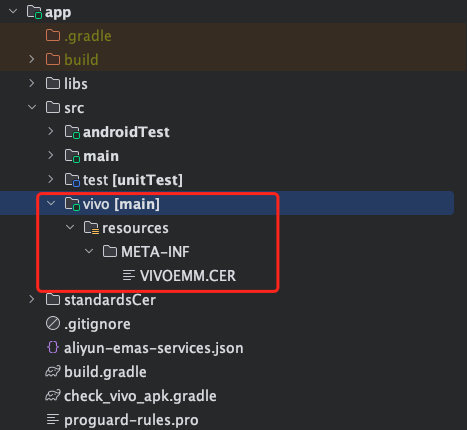
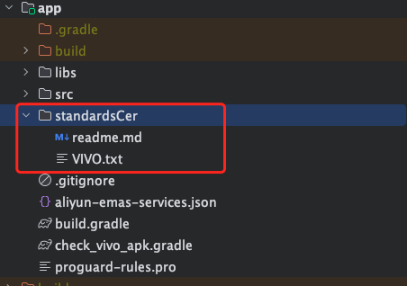

## 在Android studio 中自动导入VIVO开发证书
APP目录下创建文件夹
1. 
2. app 下的build.gradle 中引入下方脚本，并根据你的项目修改脚本中`project.ext.vivoCerFlag = ["dev"]`
    ```groovy
        //app 下的build.gradle 
       apply from: "check_vivo_apk.gradle"
    ```
3. app 下的build.gradle 中设置VIVO证书目录
    ```groovy
        flavorDimensions "dev"
        productFlavors {
             dimension "dev"
             dev {
                sourceSets {
                    dev.resources.srcDirs 'src/vivo/resources'
                }
            }
        }
    ```
4. 项目根目录下创建标准证书目录并导入标准证书

    标准证书可以是你首个VIVO开发证书，也可以是首个VIVO正式证书，标准证书用于检测后续你的证书变更，一般不用变更除非你的关联包名、系统权限、VIVO权限、应用包名有做变更才做标准证书替换



### 效果展示
#### 不携带证书：
    ```log
        Checking Vivo Cer APKChecking Start
        Checking Vivo Cer APKCheck Count：1
        Checking Vivo Cer file check passed!
    
        ------------------------------
        variantName:prodRelease
        applicationId:com.x.x
        apkFile:xxxxxxxxxxxxxxxxxxxxxxxxxxxxx.apk
        result:不携带VIVO证书
        ------------------------------
    ```
#### 携带证书
  ```log
        Checking Vivo Cer APKChecking Start
        Checking Vivo Cer APKCheck Count：1
        Checking Vivo Cer 暂存APK CER:/app/build/vivocercache/apk_vivo_cer.txt
        Checking Vivo Cer 标准证书对比:/app/standardsCer/VIVO.txt
        Checking Vivo Cer file check passed!

        ------------------------------
        variantName:devTestRelease
        applicationId:com.x.x
        apkFile:xxxxxxxxxxxxxxxxxxxxxxxxxxxxx.apk
        result:VIVO 开发证书
        ------------------------------
  ```

#### 自动导入gradle脚本

```groovy
import java.nio.file.Files
import java.nio.file.Paths
import java.util.jar.JarFile

/*
VIVO证书检测：
1.监听编译生命周期，projectsEvaluated周期开始时候通过添加依赖任务vivoApkCheckxxx
到assemble执行前获取配置信息
2.检测相关项目：
    1.商用证书无法自动导入
    2.非法证书导入
    3.证书与应用不匹配
    4.源证书与APK证书不一致
    5.非VIVO版本不能添加VIVO 证书
    6. vivo权限和System权限完整性检测，关联包检测
*/

def buildApk = new ArrayList<BuildInfo>()
//VIVO 证书配置关键值 用于匹配productFlavors中关于VIVO的Flavor
//只要包含该值都会验证证书
project.ext.vivoCerFlag = ["dev", "devTest", "prodDebug"]
//所有项目评估完成（配置阶段结束），添加依赖任务，
gradle.projectsEvaluated { gradle ->
    buildApk.clear()
    // 当执行assemble相关方法添加配置信息，以便完成打包后检测APK
    android.applicationVariants.configureEach { variant ->
        variant.outputs.configureEach { output ->
            def apkFile = output.outputFile
            def variantName = variant.name.capitalize()
            task "vivoApkCheck${variantName}" {
                doLast {
                    buildApk.add(new BuildInfo(variant.name, variant.applicationId, apkFile))
                }
            }
            // 执行任务
            def assembleProdRelease =
                    tasks.findByName("assemble" + variantName)
            def vivoApkCheck =
                    tasks.findByName("vivoApkCheck${variantName}")
            // 2. assembleProdRelease 执行之后执行 vivoApkCheck
            assembleProdRelease.finalizedBy(vivoApkCheck)
        }
    }
}


//监听编译完成，添加检测任务检测生成APK是否正确配置VIVO证书
gradle.buildFinished { BuildResult buildResult ->
    println "Checking Vivo Cer APKChecking Start"
    println "Checking Vivo Cer APKCheck Count：${buildApk.size()}"
    buildApk.forEach {
        def creSourceFile = new File("${project.projectDir}/src/vivo/resources/META-INF/VIVOEMM.CER")
        if (!creSourceFile.exists()) {
            throw GradleException("Checking Vivo Cer\n $creSourceFile\n 不存在，请不要修改其路径或者删除该文件")
        }
        checkAPK(it, creSourceFile)
        println "$it"
    }
    buildApk.clear()
    println "Checking Vivo Cer APKChecking Finish"
}


/**
 * 编译时检测预装应用是否存在正式证书
 */
def checkAPK(BuildInfo buildInfo, File creSourceFile) {
    //        // 获取当前变体的输出文件
    if (buildInfo.apkFile == null || !buildInfo.apkFile.exists()) {
        throw new GradleException("Checking Vivo Cer APK文件没有找到 Aborting...")
    }
    // 读取 apk 文件的内容
    def content = readApkFile(buildInfo.apkFile)
   if (content != null) {
       def tempFilePath = "${project.buildDir}/vivocercache/apk_vivo_cer.txt"
       def standardsCerPaht = "${project.projectDir}/standardsCer/VIVO.txt"
       deleteWriteToTempFile(content, tempFilePath)
       def apkFileCerInfo = readCerInfoFromFile(tempFilePath)
       def standardsCerInfo = readCerInfoFromFile(standardsCerPaht)
       def isVivo = project.ext.vivoCerFlag.any { item -> buildInfo.variantName.startsWith(item) }
       if (!isVivo) {
           throw new GradleException("Checking Vivo Cer  VIVO 仅prodDebug、devTest、dev、能添加VIVO证书")
       }
       // 检查文件内容是否包含测试证书
       if ("debug" == apkFileCerInfo.getCustomShortName()) {
           // 找到最后一个 "." 的位置
           buildInfo.result = "VIVO 开发证书"
       } else if ("BJCFXX-EP" == apkFileCerInfo.getCustomShortName()) {
           throw new GradleException("Checking Vivo Cer  商用证书无法自动导入")
       } else {
           throw new GradleException("Checking Vivo Cer  非法证书导入")
       }
       if (apkFileCerInfo.getPackageName() != "${buildInfo.applicationId}") {
           throw new GradleException("Checking Vivo Cer  证书与应用不匹配")
       }
       //与标准证书对比
       //比较包名
       println("Checking Vivo Cer 标准证书对比:${standardsCerPaht.replace(project.rootDir.absolutePath,"")}")
       if (apkFileCerInfo.getPackageName() != standardsCerInfo.getPackageName()) {
           throw new GradleException("Checking Vivo Cer 标准证书中PackageName 与apk中证书包名不一致，抛出异常！")
       }
       //比较系统权限
       for (final def item in standardsCerInfo.getSystemPermissions()) {
           if (!apkFileCerInfo.getSystemPermissions().contains(item)){
               throw new GradleException("Checking Vivo Cer  标准证书中SystemPermissions 中的值 '$item' 不存在，抛出异常！")
           }
       }
       //比较vivo权限
       for (final def item in standardsCerInfo.getPermissions()) {
           if (!apkFileCerInfo.getPermissions().contains(item)){
               throw new GradleException("Checking Vivo Cer  标准证书中Permissions 中的值 '$item' 不存在，抛出异常！")
           }
       }
       //比较关联包
       for (final def item in standardsCerInfo.getRelatedPackageNames()) {
           if (!apkFileCerInfo.getRelatedPackageNames().contains(item)){
               throw new GradleException("Checking Vivo Cer  标准证书中RelatedPackageNames 中的值 '$item' 不存在，抛出异常！")
           }
       }

       if (content != creSourceFile.getText()) {
           throw new GradleException("Checking Vivo Cer  源证书与APK证书不一致")
       }
   }else {
       buildInfo.result = "不携带VIVO证书"
   }

    println "Checking Vivo Cer file check passed!"
}

def readApkFile(File file) {
    // 定义要读取的文件路径
    def cerFilePath = "META-INF/VIVOEMM.CER"
    // 使用 Java 的 JarFile 类读取 APK 文件内容
    def apkFile = new java.util.jar.JarFile(file)
    // 获取 APK 文件中指定路径的条目
    def entry = apkFile.getEntry(cerFilePath)
    // 检查条目是否存在
    if (entry == null) {
        return null
    }
    // 使用 JarFile 的 getInputStream 方法读取文件内容
    def inputStream = apkFile.getInputStream(entry)
    // 读取文件内容
    def content = inputStream.getText()
    // 关闭输入流
    inputStream.close()
    apkFile.close()
    return content
}

 void deleteWriteToTempFile(String content, String filePath) {
    def file=new File(filePath)
    if (file.exists()) {
        file.delete()
    }
    if (!file.parentFile.exists()){
        file.parentFile.mkdirs()
    }

    def printName = "${filePath.replace(project.rootDir.absolutePath, "")}"
    println("Checking Vivo Cer 暂存APK CER:" + printName)
    try (BufferedWriter writer = new BufferedWriter(new FileWriter(file))) {
        writer.write(content)
    } catch (IOException e) {
        println("写入缓存文件错误：$printName")
        e.printStackTrace()
    }
}


class BuildInfo {
    File apkFile
    String variantName
    String applicationId
    String result

    BuildInfo(String variantName, String applicationId, File apkFile) {
        this.apkFile = apkFile
        this.variantName = variantName
        this.applicationId = applicationId
    }

    @Override
    String toString() {
        return "\n------------------------------\n" +
                "variantName:$variantName\n" +
                "applicationId:$applicationId\n" +
                "apkFile:${apkFile.getName()}\n" +
                "result:${result}\n" +
                "------------------------------\n"
    }
}


// 定义一个函数来读取文件并返回 CerInfo 类的对象
static CerInfo readCerInfoFromFile(String filePath) {
    // 读取文件内容
    def lines = Files.readAllLines(Paths.get(filePath))

    // 创建一个 CerInfo 对象
    CerInfo cerInfo = new CerInfo()

    // 解析文件内容并设置 CerInfo 对象的属性
    lines.each { line ->
        def parts = line.split(':')
        def key = parts[0].trim()
        def value = parts[1].trim()

        switch (key) {
            case 'CustomShortName':
                cerInfo.setCustomShortName(value)
                break
            case 'PackageName':
                cerInfo.setPackageName(value)
                break
            case 'RelatedPackageNames':
                cerInfo.setRelatedPackageNames(value.split(';').collect { it.trim() })
                break
            case 'DeveloperKey':
                cerInfo.setDeveloperKey(value)
                break
            case 'Permissions':
                cerInfo.setPermissions(value.split(';').collect { it.trim() })
                break
            case 'SystemPermissions':
                cerInfo.setSystemPermissions(value.split(';').collect { it.trim() })
                break
            case 'DeviceIds':
                cerInfo.setDeviceIds(value)
                break
            case 'ValidPeriod':
                cerInfo.setValidPeriod(value)
                break
            case 'ApkHash':
                cerInfo.setApkHash(value)
                break
            case 'Signature':
                cerInfo.setSignature(value)
                break
            default:
                // 对于其他属性，忽略或者自行处理...
                break
        }
    }

    // 返回 CerInfo 对象
    return cerInfo
}

public class CerInfo {
    private String customShortName
    private String packageName
    private List<String> relatedPackageNames
    private String developerKey
    private List<String> permissions
    private List<String> systemPermissions
    private String deviceIds
    private String validPeriod
    private String apkHash
    private String signature

    // Getter 和 Setter 方法
    String getCustomShortName() {
        return customShortName
    }

    void setCustomShortName(String customShortName) {
        this.customShortName = customShortName
    }

    String getPackageName() {
        return packageName
    }

    void setPackageName(String packageName) {
        this.packageName = packageName
    }

    List<String> getRelatedPackageNames() {
        return relatedPackageNames
    }

    void setRelatedPackageNames(List<String> relatedPackageNames) {
        this.relatedPackageNames = relatedPackageNames
    }

    String getDeveloperKey() {
        return developerKey
    }

    void setDeveloperKey(String developerKey) {
        this.developerKey = developerKey
    }

    List<String> getPermissions() {
        return permissions
    }

    void setPermissions(List<String> permissions) {
        this.permissions = permissions
    }

    List<String> getSystemPermissions() {
        return systemPermissions
    }

    void setSystemPermissions(List<String> systemPermissions) {
        this.systemPermissions = systemPermissions
    }

    String getDeviceIds() {
        return deviceIds
    }

    void setDeviceIds(String deviceIds) {
        this.deviceIds = deviceIds
    }

    String getValidPeriod() {
        return validPeriod
    }

    void setValidPeriod(String validPeriod) {
        this.validPeriod = validPeriod
    }

    String getApkHash() {
        return apkHash
    }

    void setApkHash(String apkHash) {
        this.apkHash = apkHash
    }

    String getSignature() {
        return signature
    }

    void setSignature(String signature) {
        this.signature = signature
    }
}
```